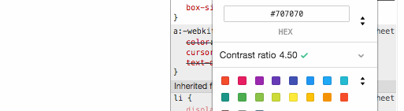

# Opdracht 1.1

## Breedband

### Wat is breedband?
Een snelle verbinding is niet altijd vanzelfsprekend. Je hebt namelijk meestal geen snelle verbinding. Dit kan problemen opleveren voor de user experience. Je moet er dus rekening mee houden tijdens development. In dit onderzoek beschrijf ik de problemen die het zou kunnen opleveren, wat wij als developers eraan zouden kunnen doen en hoe je kunt testen of je er goed genoeg rekening mee hebt gehouden.

**Problemen**

Eventuele problemen van websites geoptimaliseerd voor breedband:
- Wifi in openbare ruimtes (hotels)
- 3G verbinding
- Datalimiet

**Oplossingen**

Voorbeelden van oplossingen voor bovenstaande problemen:
- Geef jezelf een richtlijn (performance budget)
- Compress afbeeldingen
- Voeg critical CSS toe

**Testen**
- Network throttling in DevTools
- Performance test via tools
	- [http://www.webpagetest.org/](http://www.webpagetest.org/)
	- [https://developers.google.com/speed/pagespeed/insights/](https://developers.google.com/speed/pagespeed/insights/)

#### Bronnen

[http://www.webpagetest.org/](http://www.webpagetest.org/)

[https://developers.google.com/speed/pagespeed/insights](https://developers.google.com/speed/pagespeed/insights/)

[https://en.wikipedia.org/wiki/Bandwidth_throttling](https://en.wikipedia.org/wiki/Bandwidth_throttling)

[https://timkadlec.com/2013/01/setting-a-performance-budget/](https://timkadlec.com/2013/01/setting-a-performance-budget/)

## Trackpad

Ook je muis of trackpad heeft invloed op de user experience. Websites horen bruikbaar te zijn zonder muis of trackpad, omdat niet iedereen die wil gebruiken. Soms is het zelfs sneller om een website te gebruiken zonder.

### Problemen

Eventuele problemen van muis of trackpad:
- Motorische beperkingen
- Lege batterijen 
- Smart tv besturing

### Oplossingen

Voorbeelden van oplossingen:
- Focus states (CSS)
- Semantische HTML
- Accesskeys
- Eventueel ARIA labels

#### Bronnen

[https://www.w3schools.com/tags/att_global_accesskey.asp](https://www.w3schools.com/tags/att_global_accesskey.asp)

[https://www.washington.edu/accessibility/checklist/focus/](https://www.washington.edu/accessibility/checklist/focus/)

# Opdracht 1.2
Voor deze opdracht check ik mijn [OBA Web App](https://viennam.github.io/project1-quick-hack-prototype/) op de 8 features uit opdracht 1.1 en verbeter de code waar mogelijk. ([Verbeterde versie](https://posters-amsterdam.herokuapp.com/)) Vervolgens test ik de app in het device lab en laat ik het voorlezen door een screenreader. 

## 8 Features

### 1. Afbeeldingen

**Problemen**
- De hele app is gebaseerd op afbeeldingen, wanneer afbeeldingen geblokkeerd worden is de app niet meer relevant.
- Svg afbeeldingen worden niet in elke browser ondersteund.

**Oplossingen**
- Om de afbeeldingen sneller te laden heb ik ze compressed. Dit scheelt gemiddeld 2kb per afbeelding.

### 2. Custom fonts

**Problemen**
- Er wordt een font uit Google Fonts gedownload, hier staat standaard geen `font-display: swap;` op.

**Oplossingen**
- Wanneer het font niet wordt geladen, wordt het standaard font `sans-serif`.

### 3. JavaScript

**Problemen**
- De hele app is gebaseerd op client-side JavaScript. Dit zorgt ervoor dat de app onbruikbaar is zonder JavaScript. Op de header en navigatie na wordt er niks geladen.

**Oplossingen**
- Met het vak Performance Matters heb ik de app omgezet naar een server-side app. Hierdoor blijft de app bruikbaar, ook zonder JavaScript.

### 4. Kleur

**Problemen**
- Op het middelste niveau van comformiteit scoort het contrast voldoende, op het hoogste niveau niet.

**Oplossingen**
- Door de kleur `#707070` te vervangen met `#525252`, scoort het contrast voldoende op het hoogste niveau van comformiteit. ([Contrastchecker](https://webaim.org/resources/contrastchecker/))

### 5. Breedband

**Problemen**
- Bij een langzame verbinding werkt de app matig, wel zie je een loader. De belangrijkste content moet worden opgehaald via een API, waardoor de app onbruikbaar is als dit nog niet is gebeurd.

**Oplossingen**
- Een serive worker die ervoor zorgt dat de pagina's die voorheen zijn geladen nogmaals worden geladen. Ook zonder verbinding kun je deze pagina's ophalen.

### 6. Cookies
N.v.t. (cookies worden niet gebruikt).

### 7. LocalStorage
**Problemen**
- Er wordt geen gebruik gemaakt van local storage, omdat de app bij elk bezoek nieuwe posters laadt vanuit de API.

**Oplossingen**
- Een mogelijke oplossing hiervoor is om altijd dezelfde posters te laden en een ververs functie toe te voegen.

### 8. Muis / Trackpad

**Problemen**
- De focus wordt volledig overgeslagen op de posters.
- Er zijn geen duidelijke focus states.

**Oplossingen**
- Door de structuur van html aan te passen is het nu mogelijk om te tabben naar de posters.
- Door `:focus` toe te voegen aan css is het nu duidelijk waar op de pagina je je bevindt.

## Device test
### Device lab

### Browserstack

## Screen reader

Met behulp van VoiceOver heb ik getest of het mogelijk is om met een screenreader te navigeren door de website.

Bekijk de test [hier](https://photos.app.goo.gl/VlyDNNzTY3HU2siE3)

**Bevindingen**
- Het is mogelijk om door de app te navigeren met een screenreader.
- Het is niet duidelijk dat de linkjes posters zijn, dat zou er misschien eerst voorgelezen moeten worden.
- Headings kunnen beter, alles is nu H1.