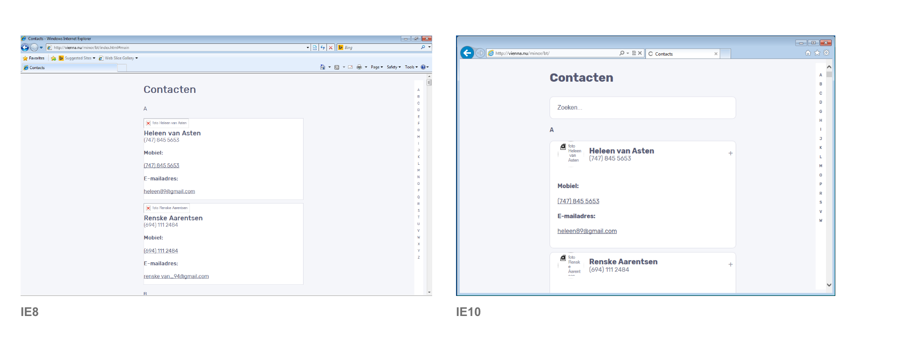

# Opdracht 3 - Progressive Enhanced Browser Technologies
Browser Technologies onderzoeken en implementeren als enhancement. Basic functionaliteit van een use case doorgronden.


## Contactenlijst
Demo: [https://viennam.github.io/browser-technologies/opdracht3/](https://viennam.github.io/browser-technologies/opdracht3/ "Contactenlijst demo")

De use case waarvan ik een demo heb gemaakt is de contactenlijst. De core functionaliteit hiervan is het filteren en bekijken van details van een contact.

### Features / Browser Technologies

**Features:**
- Toetsenbordvriendelijk
- Zoeken naar een contact
- Responsive


### Werking


De demo is opgebouwd uit drie lagen: HTML, CSS en JavaScript.

- Zonder JavaScript worden contacten in een lijst weergegeven met het alfabet aan de zijkant om te zoeken op achternaam.
- Zonder CSS is het mogelijk om de contactenlijst te filteren met behulp van een zoekfunctie. 
- Zonder JavaScript en CSS is het mogelijk om contacten op achternaam te zoeken met behulp van anchor links.

### User experience


In de demo heb ik rekening gehouden met toegankelijkheid voor slechtzienden. Ik heb bijvoorbeeld een 'skip to content' link en focus states toegevoegd voor toetsenbordgebruikers. Het contrast heb ik getest met de [Funkify](http://www.funkify.org/) extensie.

### Feature detection

#### querySelectorAll

Omdat er geen goede crossbrowser alternatief is voor `querySelector`, is mijn belangrijkste check of `querySelector` beschikbaar is in de browser. 
Vanaf IE9 is `querySelector` volledig ondersteund, waardoor ik alle functies die ook vanaf IE9 ondersteund zijn kan gebruiken in mijn code.

[Browser support](https://caniuse.com/#search=queryselector)

```javascript
if (typeof document.querySelectorAll === 'function') {
  // code ...
}
```

#### array.includes

`.includes()` wordt in IE en in oudere browsers niet ondersteund. Een alternatief hiervoor is `.indexOf()`. Hiermee kan ik alsnog zien welke namen niet overeenkomen met de zoekopdracht en deze verbergen.

[Browser support](https://caniuse.com/#search=includes)

```javascript
if (typeof [].includes === 'function') { 
  // use .includes
} else {
  // use .indexOf
}
```
#### forEach

Vanaf IE10 wordt `forEach()` volledig ondersteund. In IE9 moeten `forEach()` dus worden vervangen door `for` loops. 

[Browser support](https://caniuse.com/#search=foreach)

```javascript
if (typeof NodeList.prototype.forEach === 'function') { 
  // use forEach
} else {
  // use for loop
}
```

#### addEventListener

De 'terug naar boven' knop staat los van de zoekfuncties van de app. Daarom kan ik deze beschikbaar maken in browsers ouder dan IE9. Ik vervang `addEventListener` door `attachEvent` in deze browsers. Omdat `attachEvent` ondersteund wordt tot en met IE8, moet ik deze functie ook detecteren.

[Browser support](https://caniuse.com/#search=addeventlistener)

```javascript
if (typeof document.addEventListener === 'function') { 
  // use addEventListener
} else if (typeof window.attachEvent === 'function') {
  // use attachEvent
}

```
#### CSS 

Wanneer de browser `@supports` en `position: sticky;` ondersteunt, zullen de letters boven de contacten sticky zijn. De fallback is `position: relative;`.

```css
@supports(position:sticky) {
  #main li>a {
    position: sticky;
    top: -1px;
  }
}
```

Voor de letters navigatie gebruik ik `viewport height` als `font-size`, zodat deze navigatie altijd past.

```css
.header {
  font-size: 10px;
  font-size: 1.6vh;
}
```


### Browser ondersteuning

**Browsers**

Zoals verwacht werkt de zoekfunctionaliteit niet op IE8, maar de 'terug naar boven' knop wel. Op IE10 werkt de zoekfunctionaliteit wel. Alleen werkt `flexbox` hier niet, waardoor de letters in de navigatie niet netjes worden verdeeld over de hoogte.

**Mobiele devices**

Op Kindle is navigeren moeilijk. Blijkbaar werkt `position: fixed;` niet op de alfabet navigatie, waardoor deze wegvalt wanneer je scrolt. Op Nexus werken de functies goed. Het enige wat nog niet overal goed gaat is dat het alfabet niet in het scherm past.


Met behulp van [BrowserStack](https://www.browserstack.com/) heb ik op een aantal mobiele devices getest. Opvallend is dat op de meeste devices JavaScript in de browser wordt ondersteund.

### To do
- [ ] Contactenlijst server side serveren
- [ ] Contacten kunnen toevoegen / wijzigen / verwijderen
- [x] Feedback wanneer er geen contacten zijn gevonden
- [ ] Alfabet navigatie overal passend maken


## Bronnen


[Funkify](http://www.funkify.org/)

[BrowserStack](https://www.browserstack.com/)

## Aanpassingen
- [x] Semantische HTML elementen vervangen.
- [x] JS browser support verbeterd.
- [x] 'Terug naar boven' knop toegevoegd.
- [x] Shim verwijderd.
- [x] Position sticky toegevoegd.
- [x] Arrow function vervangen.